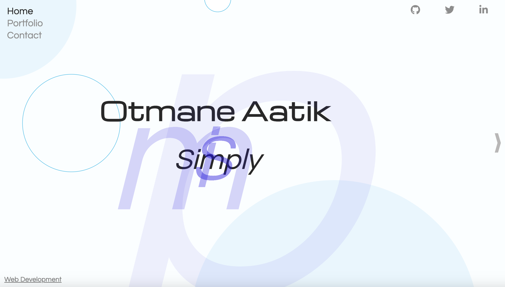
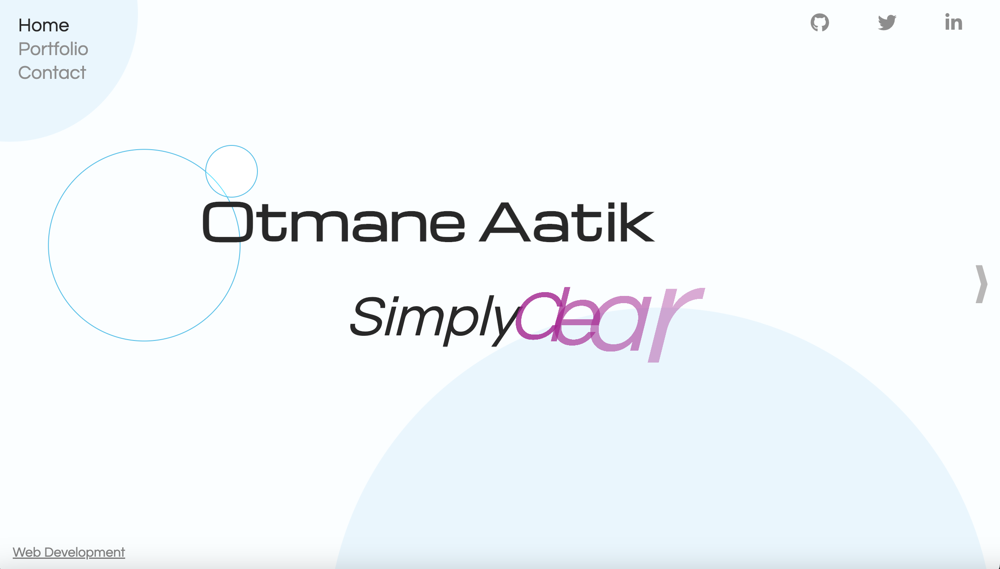

# Otmane's Portfolio

Portfolio website built in React.  
This was a website built to showcase my technical skills, web design skills.

### Why:    
A portfolio website is a crucial tool for any web developer looking to establish themselves in the industry, attract new clients or advance their career.   

Building my website is an excellent way to demonstrate my skills and abilities to potential employers or clients. By showcasing some of my previous work, a web developer can provide evidence of their expertise and experience in creating websites and applications.

### Contact information:   
Aaotmane@gmail.com    
[Twitter](https://twitter.com)    
[LinkedIn](https://www.linkedin.com/in/otmane-aatik/)    

### Tech Stack:  
- React
- React Router
- React Hooks: { useState, useEffect, useRef }
- SASS/SCSS
- DOM Manipulation
- Framer-motion
- Axios
- EmailJS
- Copy-to-clipboard

### API Reference:
```http: api.weatherapi.com
  GET `http://api.weatherapi.com/v1/current.json?[API_KEY]`
```

| Parameter | Type     | Description                |
| :-------- | :------- | :------------------------- |
| `api_key` | `string` | **Required**. Your API key |


## Screenshots:



### Link:   
[Otmane Aatik](https://otmaneaatik.netlify.app)

## Feedback:
If you have any feedback, please reach out to me at aaotmane@gmail.com

### copyright:    
Copyright © 2023 Otmane Aatik. All Rights Reserved. 
  

